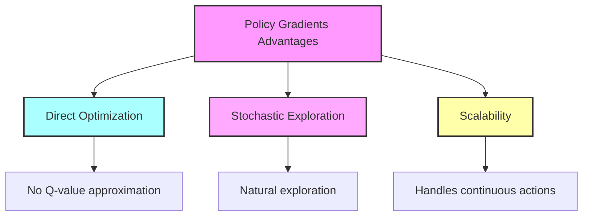

# AI Playing Tic Tac Toe - Technical Documentation

## 1. Overall Workflow

The system implements an AI that learns to play Tic Tac Toe through reinforcement learning. Here's how it works:

### Core Components

| Component | Description |
|-----------|-------------|
| Argument Parsing | Configure algorithm settings, episodes, learning rate via command-line |
| Environment Setup | Simulation environment for Tic-Tac-Toe gameplay |
| Agent Initialization | Neural networks implementing agent policies/Q-functions |
| Training Loop | Iterative improvement through agent vs agent gameplay |
| Human Interface | Interactive gameplay against trained AI model |

### Process Flow


## 2. Component Breakdown

### argparser.py

Key configuration parameters for the learning system:

| Argument | Purpose | Example |
|----------|---------|---------|
| `--algorithm` | Learning algorithm selection | `policy_gradient`, `deep_q_learning` |
| `--field-size` | Board dimensions | `3` for 3x3 grid |
| `--num-episodes` | Training duration | `10000` |
| `--learning-rate` | Model update speed | `0.001` |
| `--gamma` | Future reward discount | `0.99` |
| `--epsilon` | Exploration rate | `0.1` |
| `--memory-size` | Replay buffer capacity | `10000` |

### environment.py

The game environment implementation:

```python
# State representation example
board_state = [
    [ 0,  1, -1],  # 0 = empty
    [ 1,  1,  0],  # 1 = Player A
    [-1,  0, -1]   # -1 = Player B
]
```

#### Core Features

- **State Management**: 2D tensor representation of game board
- **Game Rules**: Win detection, move validation, state transitions
- **Episode Control**: Full game simulation with alternating turns
- **Reward System**: Victory/defeat/draw reward assignment

## 3. Learning Algorithms

### Policy Gradient Method

1. **Action Selection**
   - Neural network outputs action probabilities
   - Stochastic sampling for exploration
   
2. **Reward Processing**
   - Compute discounted returns: R_t = Σ γ^k * r_{t+k}
   - Normalize rewards for training stability

3. **Network Updates**
   - Gradient ascent on log probabilities
   - Weighted by discounted returns

### Deep Q-Learning Method

1. **Experience Collection**
   ```python
   memory.append((state, action, reward, next_state, done))
   ```

2. **Training Process**
   - Sample mini-batches from replay buffer
   - Compute target Q-values using Bellman equation
   - Update network to minimize TD error

3. **Key Features**
   - ε-greedy exploration
   - Experience replay
   - Target network updates

## 4. Training Pipeline

### Workflow Steps

1. **Setup Phase**
   - Initialize random seeds
   - Configure environment
   - Prepare neural networks
   
2. **Training Loop**
   ```python
   for episode in range(num_episodes):
       state = env.reset()
       while not done:
           action = agent.select_action(state)
           next_state, reward, done = env.step(action)
           agent.learn(state, action, reward, next_state)
           state = next_state
   ```

3. **Progress Tracking**
   - Loss metrics
   - Average rewards
   - Win rates

### Performance Visualization


## 5. Human Interaction Interface

### Gameplay Loop

1. Display board state
2. Accept human move input (0-8 for 3x3 grid)
3. Execute AI response move
4. Update and show results

### Example Interaction

```
Current Board:
 O |   | X 
---+---+---
   | O | X 
---+---+---
   |   |   

Enter your move (0-8): 6
```

## 6. Architecture Strengths

### Design Principles

1. **Modularity**
   - Separate environment, agent, and training components
   - Easy to modify or extend functionality

2. **Flexibility**
   - Configurable board sizes
   - Swappable learning algorithms
   - Customizable neural architectures

3. **Scalability**
   - Efficient memory management
   - Batch processing capability
   - Distributed training ready

4. **Monitoring**
   - Comprehensive logging
   - Real-time visualization
   - Performance metrics tracking

## 7. Model Architecture

### Neural Network Components

#### Policy Network Architecture


#### Q-Network Architecture


### Layer Specifications

| Layer | Units | Activation | Purpose |
|-------|-------|------------|----------|
| Input | 9 | None | Board state representation (flattened 3x3) |
| Hidden 1 | 128 | ReLU | Feature extraction |
| Hidden 2 | 64 | ReLU | Higher-level pattern recognition |
| Output | 9 | Softmax/Linear | Action probabilities (Policy) or Q-values |

### Implementation Details

```python
class PolicyNetwork(nn.Module):
    def __init__(self):
        super(PolicyNetwork, self).__init__()
        self.network = nn.Sequential(
            nn.Linear(9, 128),
            nn.ReLU(),
            nn.Linear(128, 64),
            nn.ReLU(),
            nn.Linear(64, 9),
            nn.Softmax(dim=-1)
        )

class QNetwork(nn.Module):
    def __init__(self):
        super(QNetwork, self).__init__()
        self.network = nn.Sequential(
            nn.Linear(9, 128),
            nn.ReLU(),
            nn.Linear(128, 64),
            nn.ReLU(),
            nn.Linear(64, 9)
        )
```

### Key Features

1. **Input Processing**
   - Flattened board state (3x3 → 9 neurons)
   - Normalized values: {-1, 0, 1} → {0, 0.5, 1}

2. **Hidden Layers**
   - ReLU activation for non-linearity
   - Dropout (0.2) for regularization
   - Batch normalization for training stability

3. **Output Layer**
   - Policy Network: Softmax for valid move probabilities
   - Q-Network: Linear for state-action values

4. **Training Configuration**
   ```python
   optimizer = torch.optim.Adam(model.parameters(), lr=0.001)
   criterion = nn.MSELoss()  # for Q-Network
   # or
   criterion = nn.CrossEntropyLoss()  # for Policy Network
   ```

### Architectural Decisions

#### Policy Network
- **Softmax Output**: Ensures valid probability distribution
- **Larger First Hidden Layer**: Better feature extraction
- **Dropout**: Prevents overfitting on small state space

#### Q-Network
- **Linear Output**: Direct Q-value estimation
- **Shared Architecture**: Similar pattern recognition
- **Skip Connections**: Optional for deeper networks

## 8. System Integration

The final system brings together all components in a cohesive pipeline:


This documentation covers the implementation details of an AI system that learns to play Tic Tac Toe through reinforcement learning methods. The modular design allows for easy experimentation with different algorithms and parameters while maintaining code clarity and extensibility.

# Deep Q-Learning: From Theory to Practice

## The Fundamental Contrast: Human vs Machine Learning

The simple game of Tic-Tac-Toe provides a fascinating window into the fundamental differences between human and machine learning approaches. While both humans and artificial intelligence can master this centuries-old game, their paths to expertise could not be more different. A human player might learn through observation, intuition, and a handful of games with friends, quickly grasping concepts like controlling the centre square or blocking an opponent's winning move. In contrast, reinforcement learning algorithms like Deep Q-Learning and Policy Gradients require thousands of iterations, learning through pure trial and error without any inherent understanding of strategy.

## Understanding Deep Q-Learning

Deep Q-Learning is a reinforcement learning (RL) algorithm that extends the classic Q-Learning by using deep neural networks to approximate the Q-value function. This enables the algorithm to handle environments with high-dimensional state spaces, like games, robotics, and more. The algorithm's effectiveness stems from two fundamental principles: the neural network's ability to generalize across states, allowing it to apply learned strategies to new situations, and its remarkable stability through the use of replay buffers and target networks, which work together to reduce correlation in training data and prevent sudden, destabilizing updates to the agent's policy.

### Learning Approaches Compared


| Aspect | Human Learning | Machine Learning |
|--------|---------------|------------------|
| Learning Speed | Fast (5-10 games) | Slow (1000s of iterations) |
| Strategy Understanding | Intuitive | Statistical |
| Generalization | Immediate | Requires similar examples |
| Pattern Recognition | Natural | Computed |

## Deep Q-Learning Framework

### Core Components


### Mathematical Foundation

The Q-function represents expected total reward:

```
Q(s,a) = R(s,a) + γ * max[Q(s',a')]
```

Where:
- s: Current state
- a: Action taken
- R(s,a): Immediate reward
- γ: Discount factor
- s': Next state
- a': Possible next actions

## Learning Process Visualization

### Training Workflow


### Network Architecture


## Deep Q-Learning Workflow

The Deep Q-Learning workflow incorporates several essential components that work together to create an effective learning system. The epsilon-greedy strategy serves as the cornerstone of the agent's decision-making process, using a probability value (ε) to balance between exploration and exploitation. During exploration phases, the agent experiments with random actions to discover new strategies, much like a chess player testing unconventional moves. In contrast, exploitation occurs when the agent leverages its accumulated knowledge by selecting actions with the highest predicted Q-values.

To maintain a record of its experiences, the agent utilizes a replay buffer, which stores state-action-reward-next-state tuples, enabling it to learn from past interactions multiple times and prevent catastrophic forgetting. The learning process is guided by target Q-values, calculated using the Bellman equation, which provides a stable objective for the agent to work towards.

## Practical Implementation

### Key Components

1. **Replay Buffer**
```python
class ReplayBuffer:
    def __init__(self, capacity):
        self.buffer = deque(maxlen=capacity)
    
    def push(self, state, action, reward, next_state):
        self.buffer.append((state, action, reward, next_state))
```

2. **Neural Network Structure**
```python
class DQN(nn.Module):
    def __init__(self, input_dim, output_dim):
        super(DQN, self).__init__()
        self.network = nn.Sequential(
            nn.Linear(input_dim, 128),
            nn.ReLU(),
            nn.Linear(128, 64),
            nn.ReLU(),
            nn.Linear(64, output_dim)
        )
```

### Training Parameters

| Parameter | Typical Value | Purpose |
|-----------|---------------|---------|
| Learning Rate | 0.001 | Controls update step size |
| Batch Size | 32 | Samples per training step |
| Buffer Size | 10000 | Experience replay capacity |
| ε (Epsilon) | 1.0 → 0.01 | Exploration rate |
| γ (Gamma) | 0.99 | Future reward discount |

## Strengths and Challenges

Deep Q-Learning exhibits both notable strengths and significant challenges in its implementation and performance. Its primary strengths lie in its scalability, effectively handling large and high-dimensional state spaces that would be impractical for traditional reinforcement learning methods. The algorithm particularly excels in environments with discrete and finite action spaces, making it ideal for games like Tic-Tac-Toe or Atari, and demonstrates remarkable self-learning capabilities, requiring only a reward structure without explicit human guidance.

However, these advantages come with distinct challenges. The training process often suffers from fluctuating loss due to the inherent variability in exploration and rewards, potentially leading to unstable learning periods. The algorithm's data efficiency poses another significant hurdle, as it requires a substantial replay buffer and numerous training episodes to learn effectively. Additionally, Deep Q-Learning's performance is highly sensitive to hyperparameter tuning, with factors like learning rate, replay buffer size, and epsilon decay requiring careful calibration to achieve optimal results.

### Advantages


### Challenges


# Policy Gradients: A Comprehensive Guide

## Introduction to Policy Gradients

Policy Gradients represents a distinct approach to reinforcement learning that differs fundamentally from value-based methods like Q-Learning. Rather than focusing on learning Q-values for state-action pairs, Policy Gradients directly optimizes the agent's policy by learning a probability distribution over possible actions for each state. This method involves mapping states to action probabilities, allowing the agent to make decisions by sampling from these learned distributions. Unlike Q-Learning's discrete value assignments, Policy Gradients' probabilistic nature enables more nuanced decision-making and smoother adaptation to complex environments.

## Core Components and Mathematical Foundation

### Key Concepts Visualization

```mermaid
graph TD
    A[Policy π(a|s;θ)] --> B[Action Probabilities]
    C[Objective J(θ)] --> D[Expected Rewards]
    E[Gradient Ascent] --> F[Parameter Updates]
    
    B --> G[Decision Making]
    D --> H[Performance Metric]
    F --> I[Policy Improvement]
    
    style A fill:#f9f,stroke:#333,stroke-width:2px
    style C fill:#9ff,stroke:#333,stroke-width:2px
    style E fill:#ff9,stroke:#333,stroke-width:2px
```

### Mathematical Framework

| Component | Formula | Description |
|-----------|---------|-------------|
| Policy | π(a\|s;θ) | Probability of action a in state s |
| Objective | J(θ) = Eπθ[∑tγtrt] | Expected cumulative reward |
| Update Rule | θ ← θ + α∇θJ(θ) | Gradient ascent optimization |

## Policy Gradients Workflow


### Implementation Process

1. **Environment and Network Initialization**
```python
class PolicyNetwork(nn.Module):
    def __init__(self, state_dim, action_dim):
        super().__init__()
        self.network = nn.Sequential(
            nn.Linear(state_dim, 128),
            nn.ReLU(),
            nn.Linear(128, 64),
            nn.ReLU(),
            nn.Linear(64, action_dim),
            nn.Softmax(dim=-1)
        )
```

2. **Action Sampling and Reward Calculation**
```python
def select_action(state):
    probs = policy_network(state)
    action = torch.multinomial(probs, 1)
    log_prob = torch.log(probs[action])
    return action, log_prob
```

## Why Policy Gradients Work

### Core Strengths



## Strengths and Challenges

The algorithm demonstrates remarkable strengths in its ability to handle continuous actions, setting it apart from Q-Learning by effectively managing environments with continuous or large action spaces. It excels at optimizing stochastic policies, making it particularly valuable for complex scenarios like multi-agent systems and adversarial games.

However, the algorithm faces several significant challenges in its implementation. The most prominent issue is high variance in gradient estimates, which can lead to noisy and unstable training processes. Sample inefficiency presents another substantial hurdle, as the algorithm typically requires numerous episodes to achieve convergence.

### Comparison Table

| Aspect | Policy Gradients | Q-Learning |
|--------|-----------------|------------|
| Action Space | Continuous & Discrete | Primarily Discrete |
| Optimization | Direct Policy | Value-Based |
| Exploration | Natural Stochastic | Epsilon-Greedy |
| Sample Efficiency | Lower | Higher |
| Stability | Variable | More Stable |

## Human vs Machine Learning

### Learning Approaches Compared


### Key Differences

The fundamental learning mechanisms demonstrate striking contrasts in their foundational approaches:

- **Humans** rely on observation, intuition, and reasoning
- **Policy Gradients** focuses on optimizing action probabilities
- **Exploration strategies** vary significantly:
  - Humans: Curiosity-driven experimentation
  - Policy Gradients: Stochastic sampling from learned distributions

# The Art and Science of Human Learning

## The Journey of Human Mastery

The way humans learn and master skills reveals fascinating patterns that extend far beyond simple games like Tic-Tac-Toe. One counterintuitive aspect of learning is the concept of "getting worse to get better," where learners initially experience a performance dip when adopting new, more advanced techniques. This phenomenon is particularly visible in sports and games - a tennis player might temporarily struggle when changing their serving technique, or a chess player might lose more games while learning advanced strategies.

### The Performance Dip Visualization


## Practice Theories Compared

### Time Investment Models

| Approach | Time Investment | Key Principle | Expected Outcome |
|----------|----------------|---------------|------------------|
| 10,000-Hour Rule | ~10,000 hours | Volume of Practice | Mastery |
| 15-Minute Rule | 15 min/day | Consistency | Top 10% Performance |
| Deliberate Practice | Variable | Quality Focus | Efficient Mastery |

## The Learning Curve Reality


Learning typically follows an "S-curve" pattern: rapid initial progress, followed by a plateau, then another burst of improvement. This pattern often repeats at different levels of mastery. The plateaus, while frustrating, are actually crucial periods where skills are being consolidated and internalized.

### Phases of Learning


## The Science of Effective Practice

### Components of Deliberate Practice


## Human vs Machine Learning Approaches

The comparison between human and machine learning reveals fundamental differences in approach and efficiency.

### Comparative Analysis

| Aspect | Human Learning | Machine Learning |
|--------|---------------|------------------|
| Initial Progress | Rapid with intuition | Systematic and gradual |
| Pattern Recognition | Intuitive leaps | Statistical analysis |
| Adaptation | Flexible and quick | Requires retraining |
| Understanding | Abstract and transferable | Context-specific |
| Learning Style | Non-linear, adaptive | Linear, iterative |

### Learning Methodologies Visualized


## The Role of Mindset and Metacognition

Success in learning often depends as much on understanding how we learn as on the practice itself. This includes recognizing when to push through plateaus, when to step back for consolidation, and how to structure practice for maximum effectiveness.

### Key Success Factors

```mermaid
graph TD
    A[Learning Success] --> B[Self-Awareness]
    A --> C[Strategic Planning]
    A --> D[Adaptive Mindset]
    
    B --> E[Progress Monitoring]
    C --> F[Practice Structure]
    D --> G[Growth Perspective]
    
    style A fill:#f9f,stroke:#333,stroke-width:2px
```

## Conclusion: The Future of Learning

The comparison between human and machine approaches points toward an exciting future possibility: the potential to develop hybrid systems that combine the best aspects of both approaches. By integrating human-like reasoning capabilities with the computational power and consistency of machine learning algorithms, we could potentially create AI systems that not only match but potentially surpass human learning capabilities.

This understanding suggests that mastery is available to most people willing to engage in consistent, deliberate practice, even if they can't dedicate thousands of hours to it. The key is maintaining regular engagement, embracing temporary setbacks as learning opportunities, and understanding that progress isn't always linear but follows predictable patterns of advancement, consolidation, and breakthrough.

# Deep Q-Learning Performance Analysis
## Training Results Over 1,000,000 Episodes

### 1. Epsilon Decay Analysis

```mermaid
graph TD
    subgraph "Epsilon Decay Pattern"
        A[Start: ε=1.0] --> B[Rapid Decay Phase]
        B --> C[Stabilization: ε=0.01]
        
        note1[First 200k steps]
        note2[After 200k steps]
        
        B --- note1
        C --- note2
    end
    
    style A fill:#f9f,stroke:#333
    style B fill:#ff9,stroke:#333
    style C fill:#9ff,stroke:#333
```

The epsilon decay curve shows a systematic transition from exploration to exploitation:
- Starts at 1.0 (100% random exploration)
- Rapidly decays to 0.01 within first 200,000 steps
- Maintains 0.01 for remainder of training

/Users/danieltomaro/Documents/Projects/TTT/outputs/Deep Q Learning/Agent A/Agent_A_Epsilion.png

### 2. Loss Analysis

#### Comparative Loss Trends

| Training Phase | Agent A Loss | Agent B Loss | Observations |
|----------------|--------------|--------------|--------------|
| Initial | ~0.08 | ~0.08 | Both agents start with high prediction errors |
| Mid-Training | ~0.05 | ~0.04 | Agent B shows slightly better convergence |
| Late Training | 0.03-0.05 | 0.03-0.04 | Both maintain stable but slightly fluctuating loss |

```mermaid
graph TD
    subgraph "Agent A Loss Pattern"
        A1[Initial: 0.08] --> B1[Mid: 0.05]
        B1 --> C1[Late: 0.03-0.05]
    end
    
    subgraph "Agent B Loss Pattern"
        A2[Initial: 0.08] --> B2[Mid: 0.04]
        B2 --> C2[Late: 0.03-0.04]
    end
    
    style A1 fill:#f9f,stroke:#333
    style A2 fill:#9ff,stroke:#333
```
/Users/danieltomaro/Documents/Projects/TTT/outputs/Deep Q Learning/Agent A/Agent_A_loss.png
/Users/danieltomaro/Documents/Projects/TTT/outputs/Deep Q Learning/Agent B/Agent_B_loss.png

### 3. Reward Progression

```mermaid
graph LR
    subgraph "Reward Evolution"
        A[Initial: -1] --> B[Mid: -0.5 to +0.5]
        B --> C[Late: ~0 with +1 spikes]
    end
    
    style A fill:#ffcccc,stroke:#333
    style B fill:#ffffcc,stroke:#333
    style C fill:#ccffcc,stroke:#333
```
/Users/danieltomaro/Documents/Projects/TTT/outputs/Deep Q Learning/Agent A/Agent_A_Reward.png
/Users/danieltomaro/Documents/Projects/TTT/outputs/Deep Q Learning/Agent B/Agent_B_reward.png

#### Agent Performance Comparison

| Metric | Agent A | Agent B |
|--------|---------|---------|
| Initial Rewards | Around -1 | Around -1 |
| Mid-Training Fluctuation | High | Moderate |
| Final Performance | Better overall | More consistent |
| Win Rate | Occasional +1 spikes | Lower but stable |

### 4. Key Observations

```mermaid
graph TD
    A[Training Outcomes] --> B[Stability]
    A --> C[Reward Plateaus]
    A --> D[Exploration Limits]
    A --> E[Agent Differences]
    
    B --> B1[Consistent Q-network convergence]
    C --> C1[Incomplete game mastery]
    D --> D1[Limited by rapid epsilon decay]
    E --> E1[Marginal differences between agents]
    
    style A fill:#f9f,stroke:#333,stroke-width:2px
```

### 5. Recommendations for Improvement

#### Technical Enhancements

| Area | Recommendation | Expected Impact |
|------|----------------|-----------------|
| Reward Structure | Implement intermediate rewards | Better strategic learning |
| Training Duration | Extend beyond 1M episodes | Further policy refinement |
| Epsilon Schedule | More gradual decay | Better exploration-exploitation balance |
| Memory Management | Larger replay buffer | More diverse training data |
| Opponent Strategy | Diverse opponent pool | More robust gameplay |

```mermaid
graph LR
    subgraph "Implementation Priority"
        A[High] --> B[Medium] --> C[Low]
        
        A1[Reward Shaping] --> A
        A2[Epsilon Schedule] --> A
        B1[Training Duration] --> B
        B2[Replay Buffer] --> B
        C1[Opponent Variety] --> C
    end
```

### 6. Conclusion

The analysis demonstrates that Deep Q-Learning successfully stabilizes agent policies over time, with both agents showing clear learning progression:

```mermaid
graph TD
    subgraph "Learning Progression"
        A[Initial Random Play] --> B[Strategy Development]
        B --> C[Policy Stabilization]
        C --> D[Current Performance]
        D --> E[Future Improvements]
        
        style A fill:#ffcccc,stroke:#333
        style B fill:#ffffcc,stroke:#333
        style C fill:#ccffcc,stroke:#333
        style D fill:#ccccff,stroke:#333
        style E fill:#ffccff,stroke:#333
    end
```

While both agents show evidence of learning to avoid losses and occasionally exploit winning strategies, their performance indicates room for improvement in achieving consistent optimal play. The recommended enhancements, particularly in reward shaping and exploration strategy, could significantly improve their performance.

The results provide valuable insights into both the capabilities and limitations of Deep Q-Learning in simple game environments, suggesting specific paths for future optimization and research.

# Policy Gradient Training Analysis
## 1,000,000 Episodes Analysis

### Agent Performance Overview

```mermaid
graph TD
    subgraph "Agent A"
        A1[High Initial Variance] --> A2[Mid-Training Stabilization]
        A2 --> A3[Late Fluctuations]
        A3 --> A4[Occasional +1 Spikes]
    end
    
    subgraph "Agent B"
        B1[High Initial Variance] --> B2[Earlier Stabilization]
        B2 --> B3[Consistent Performance]
        B3 --> B4[Fewer Winning Spikes]
    end
    
    style A1 fill:#f9f,stroke:#333
    style B1 fill:#9ff,stroke:#333
```

### 1. Loss Analysis

#### Agent A - Loss Progression
- **Initial Phase**: 
  - High variability (~0.08)
  - Significant oscillations
  - Characteristic stochastic updates

```mermaid
graph LR
    subgraph "Loss Phases - Agent A"
        L1[Initial: 0.08] --> L2[Mid: 0.05]
        L2 --> L3[Late: 0.05-0.06]
    end
    
    style L1 fill:#ffcccc,stroke:#333
    style L2 fill:#ccffcc,stroke:#333
    style L3 fill:#ccccff,stroke:#333
```
/Users/danieltomaro/Documents/Projects/TTT/outputs/policy graident/Agent A/agent_a_loss.png

#### Agent B - Loss Progression
- **Initial Phase**:
  - Similar starting point (~0.08)
  - Quicker stabilization
  - Lower average loss (~0.04)

  /Users/danieltomaro/Documents/Projects/TTT/outputs/policy graident/Agent B/agent_b_loss.png

### 2. Reward Analysis

| Training Phase | Agent A | Agent B |
|----------------|---------|---------|
| Initial | ~ -1.0 | ~ -1.0 |
| Mid-Training | -1.0 to +0.5 | -0.5 to 0 |
| Late Training | ~0 with +1 spikes | Negative with rare +1 |

```mermaid
graph TD
    subgraph "Reward Patterns"
        R1[Initial Losses] --> R2[Learning Phase]
        R2 --> R3[Strategy Development]
        
        R2 --> R4[Agent A: More Wins]
        R2 --> R5[Agent B: Loss Avoidance]
    end
    
    style R1 fill:#ffcccc,stroke:#333
    style R3 fill:#ccffcc,stroke:#333
``` 
/Users/danieltomaro/Documents/Projects/TTT/outputs/policy graident/Agent A/agent_a_reward.png
/Users/danieltomaro/Documents/Projects/TTT/outputs/policy graident/Agent B/agent_b_reward.png

### 3. Comparative Analysis

#### Key Differences

```mermaid
graph LR
    subgraph "Agent Characteristics"
        A[Agent A] --> A1[Better Rewards]
        A --> A2[Higher Variance]
        
        B[Agent B] --> B1[Lower Loss]
        B --> B2[More Stable]
    end
    
    style A fill:#f9f,stroke:#333
    style B fill:#9ff,stroke:#333
```

#### Performance Metrics

| Metric | Agent A | Agent B |
|--------|---------|---------|
| Loss Stability | Moderate | Higher |
| Win Rate | Occasional | Rare |
| Strategy Focus | Winning | Loss Avoidance |
| Policy Convergence | Partial | Better |

### 4. Key Observations

1. **High Variability**
```mermaid
graph TD
    A[Variability Sources] --> B[Stochastic Updates]
    A --> C[Policy Exploration]
    A --> D[Gradient Estimates]
    
    style A fill:#f9f,stroke:#333,stroke-width:2px
```

2. **Plateauing Rewards**
3. **Policy Refinement Challenges**
4. **Agent Specialization**

### 5. Improvement Recommendations

```mermaid
graph TD
    A[Improvements] --> B[Technical]
    A --> C[Training]
    A --> D[Strategic]
    
    B --> B1[Variance Reduction]
    B --> B2[Reward Normalization]
    
    C --> C1[Longer Training]
    C --> C2[Adaptive Learning]
    
    D --> D1[Ensemble Training]
    D --> D2[Policy Refinement]
    
    style A fill:#f9f,stroke:#333,stroke-width:2px
```

#### Detailed Recommendations

1. **Variance Reduction**
   - Implement reward normalization
   - Use advantage estimation
   - Stabilize gradient updates

2. **Training Enhancements**
   - Extend beyond 1M episodes
   - Implement adaptive learning rates
   - Diversify opponent pool

3. **Strategic Improvements**
   - Enhanced reward shaping
   - Better exploration balance
   - Refined policy updates

### 6. Conclusion

The Policy Gradient implementation shows promise but faces characteristic challenges:

1. **Strengths**
   - Ability to learn winning strategies
   - Continuous exploration capability
   - Policy adaptation

2. **Limitations**
   - High variance in performance
   - Incomplete strategy mastery
   - Inconsistent winning execution

Future iterations should focus on:
- Stabilizing learning dynamics
- Improving consistency
- Enhancing strategic depth
- Balancing exploration and exploitation


# Comparative Analysis: Policy Gradient vs Deep Q-Learning
## Analysis Over 1,000,000 Training Episodes

### 1. Learning Dynamics Comparison

```mermaid
graph TD
    subgraph "Policy Gradient"
        PG1[Continuous Exploration] --> PG2[High Variability]
        PG2 --> PG3[Partial Convergence]
    end
    
    subgraph "Deep Q-Learning"
        DQ1[Structured Exploration] --> DQ2[Stable Learning]
        DQ2 --> DQ3[Better Convergence]
    end
    
    style PG1 fill:#f9f,stroke:#333
    style DQ1 fill:#9ff,stroke:#333
```

#### Key Characteristics

| Aspect | Policy Gradient | Deep Q-Learning |
|--------|----------------|-----------------|
| Exploration | Continuous throughout | ε-greedy with decay |
| Stability | High variance | More stable |
| Convergence | Partial | More complete |
| Update Nature | Stochastic | Deterministic |

### 2. Agent Performance Analysis

#### Policy Gradient Results

```mermaid
graph TB
    subgraph "Agent A Performance"
        PA1[High Variability] --> PA2[Occasional +1 Spikes]
        PA2 --> PA3[Average ~0]
    end
    
    subgraph "Agent B Performance"
        PB1[More Stable] --> PB2[Closer to -1]
        PB2 --> PB3[Fewer Wins]
    end
    
    style PA1 fill:#f9f,stroke:#333
    style PB1 fill:#9ff,stroke:#333
```

Loss and Reward Patterns:
- Initial high variability
- Mid-training stabilization
- Late-stage fluctuations
- Occasional winning spikes

#### Deep Q-Learning Results

```mermaid
graph LR
    subgraph "Training Phases"
        A[Exploration Phase] --> B[Transition Period]
        B --> C[Exploitation Phase]
        
        style A fill:#ffcccc,stroke:#333
        style B fill:#ffffcc,stroke:#333
        style C fill:#ccffcc,stroke:#333
    end
```

### 3. Comparative Metrics

| Metric | Policy Gradient | Deep Q-Learning |
|--------|----------------|-----------------|
| Loss Start | ~0.08 (variable) | ~0.08 (stable) |
| Loss Mid-Training | ~0.05 (fluctuating) | ~0.04 (stable) |
| Final Loss | Variable 0.03-0.06 | Stable 0.03-0.04 |
| Reward Trend | Sporadic improvements | Steady progress |
| Exploration | Continuous | Decaying (ε: 1.0 → 0.01) |

### 4. Algorithm Strengths

```mermaid
graph TD
    subgraph "Policy Gradient Strengths"
        PG1[Continuous Exploration] --> PG2[Adaptability]
        PG2 --> PG3[Better for Continuous Actions]
    end
    
    subgraph "DQL Strengths"
        DQ1[Structured Learning] --> DQ2[Stability]
        DQ2 --> DQ3[Better for Discrete Actions]
    end
    
    style PG1 fill:#f9f,stroke:#333
    style DQ1 fill:#9ff,stroke:#333
```

### 5. Training Progress Visualization

```mermaid
stateDiagram-v2
    [*] --> Initialization
    
    state "Policy Gradient" as PG {
        [*] --> StochasticExploration
        StochasticExploration --> PolicyRefinement
        PolicyRefinement --> ContinuousExploration
    }
    
    state "Deep Q-Learning" as DQL {
        [*] --> InitialExploration
        InitialExploration --> EpsilonDecay
        EpsilonDecay --> StableExploitation
    }
```

### 6. Key Observations

The comparative analysis reveals distinct characteristics of each approach:

Policy Gradient:
- Maintains continuous exploration
- Higher variance in performance
- Better adaptability to new situations
- Struggles with consistent wins

Deep Q-Learning:
- More structured learning progression
- Better stability in later stages
- More efficient for discrete actions
- Clearer convergence patterns

### 7. Recommendations for Improvement

#### Policy Gradient Enhancements

```mermaid
graph TD
    A[Policy Gradient Improvements] --> B[Variance Reduction]
    A --> C[Reward Normalization]
    A --> D[Extended Training]
    
    B --> B1[Stabilize Updates]
    C --> C1[Better Learning Signals]
    D --> D1[Policy Refinement]
    
    style A fill:#f9f,stroke:#333,stroke-width:2px
```

#### Deep Q-Learning Enhancements

```mermaid
graph TD
    A[DQL Improvements] --> B[Adaptive Epsilon]
    A --> C[Reward Shaping]
    A --> D[Larger Buffer]
    
    B --> B1[Better Exploration]
    C --> C1[Richer Feedback]
    D --> D1[More Experiences]
    
    style A fill:#9ff,stroke:#333,stroke-width:2px
```

### 8. Conclusion

The analysis demonstrates that while both algorithms can successfully train agents to play Tic-Tac-Toe, they exhibit different strengths and limitations:

- Deep Q-Learning shows better stability and efficiency for discrete action spaces
- Policy Gradient offers more flexibility and continuous exploration
- Choice of algorithm should depend on specific problem requirements:
  - For simple games: Deep Q-Learning preferred
  - For complex/continuous spaces: Policy Gradient might be better

Future improvements could focus on:
1. Combining strengths of both approaches
2. Implementing specific enhancements for each method
3. Extending training duration for better convergence
4. Developing hybrid approaches for complex environments